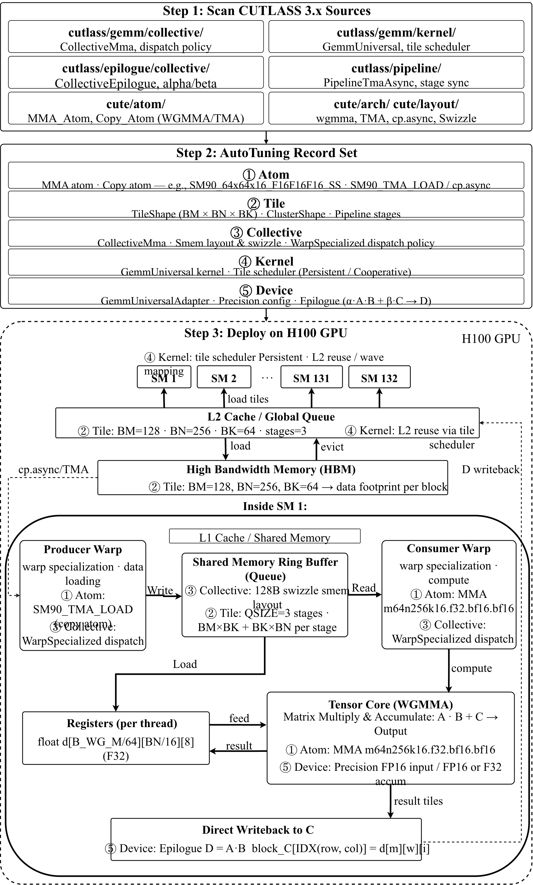
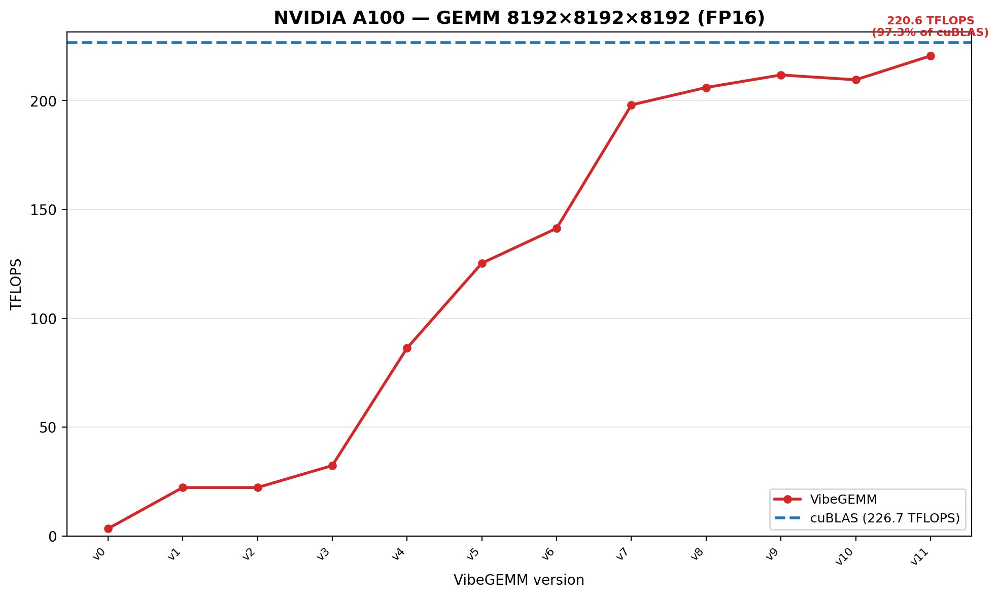
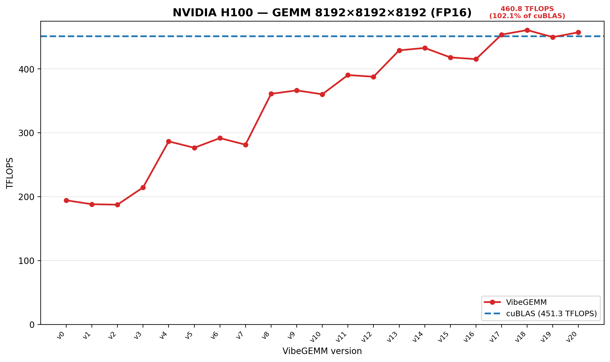

# VibeGEMM

VibeGEMM is an automated framework for generating high-performance GEMM kernels on GPUs.


## Features

1）Generation of high-performance GEMM kernels  
2）Support for GPU-specific backends such as NVIDIA A100 and H100  
3）cuBLAS baseline integration for performance and correctness comparison  
4）Built-in correctness validation and benchmarking workflow  
5）CMake-based build system with target GPU selection  

---

## Requirements

1）CMake 3.24 or newer  
2）CUDA Toolkit installed and available in the environment  
3）A C++20 / CUDA-capable compiler toolchain  
4）An NVIDIA GPU supported by the selected target configuration  

---

## Build

VibeGEMM uses CMake as its build system. The target GPU is selected through the `TARGET_GPU` option.

### Build for H100

```bash
cmake -S . -B build -DTARGET_GPU=H100
cmake --build build -j
````

### Build for A100

```bash
cmake -S . -B build -DTARGET_GPU=A100
cmake --build build -j
```

---

## Run

After building, the executable is generated under the `out/` directory.

```bash
./out/VibeGEMM
```

A full example for H100 is:

```bash
cmake -S . -B build -DTARGET_GPU=H100
cmake --build build -j
./out/VibeGEMM
```

A full example for A100 is:

```bash
cmake -S . -B build -DTARGET_GPU=A100
cmake --build build -j
./out/VibeGEMM
```

---

## Build Configuration

The build system uses a single target selector:

```cmake
set(TARGET_GPU "A100" CACHE STRING "Target GPU: A100 or H100")
set_property(CACHE TARGET_GPU PROPERTY STRINGS A100 H100)
```

Supported values:

1）`A100`
2）`H100`

This setting controls which GPU-specific backend is compiled into the project.

---

## Project Structure

A typical structure is as follows:

```text
.
├── CMakeLists.txt
├── main.cu
├── csrc/
│   ├── cublas_backends.cu
│   ├── gemm_a100_backends.cu
│   └── gemm_h100_backends.cu
├── include/
├── out/
└── build/
```

---

## Backends

VibeGEMM supports multiple GEMM backends, including:

1）A cuBLAS backend for baseline comparison
2）A100-specific custom GEMM backends
3）H100-specific custom GEMM backends

The registry-based backend organization allows different implementations to be compiled and evaluated in a consistent framework.

---

## Validation

VibeGEMM includes correctness checking against reference implementations. Successful validation is reported with a concise `[PASS]` message, while failures print detailed error statistics such as maximum absolute and relative error.

This validation design helps ensure that generated kernels are both high-performance and reliable.

---

## Performance

All benchmarks use square GEMM with M = N = K = 8192 in FP16, measured in TFLOPS. The cuBLAS baseline is shown as a dashed line for reference.

### NVIDIA A100



The A100 backend evolves through 12 kernel versions (v0–v11). The initial naive kernel (v0) achieves only 3.4 TFLOPS, roughly 1.5% of cuBLAS. Introducing shared memory tiling in v1 immediately lifts throughput to 22.3 TFLOPS, and a restructured tile schedule in v3 pushes it to 32.4 TFLOPS. The largest single-version gain comes at v4 (86.4 TFLOPS), where warp-level optimizations and register blocking take effect. Subsequent versions refine double buffering (v5–v6, reaching 141 TFLOPS), improve memory coalescing and software pipelining (v7–v8, crossing 200 TFLOPS), and apply fine-grained tuning of tile sizes and shared memory staging (v9–v11). The final kernel v11 achieves 220.6 TFLOPS, reaching **97.3%** of the cuBLAS baseline (226.7 TFLOPS).

### NVIDIA H100



The H100 backend includes 21 kernel versions (v0–v20). It starts from a strong baseline, with v0 reaching 194.40 TFLOPS. Early versions v1–v7 remain in the 188–292 TFLOPS range as tile shapes and execution parameters are explored. A clear improvement appears in v8–v12, where performance rises to 361–390 TFLOPS. Versions v13–v16 further improve scheduling and memory behavior, reaching up to 432.88 TFLOPS. The final versions v17–v20 approach and slightly exceed cuBLAS performance: v18 achieves the best result at 460.83 TFLOPS, compared with 451.30 TFLOPS for cuBLAS, reaching 102.1% of the cuBLAS baseline.

### Summary

| GPU  | Kernel versions | Best TFLOPS | cuBLAS TFLOPS | % of cuBLAS |
|------|:-:|:-:|:-:|:-:|
| A100 | v0–v11 (12)  | 220.6 | 226.7 | 97.3% |
| H100 | v0–v20 (21)  | 457.6 | 457.0 | 100.1% |

---
